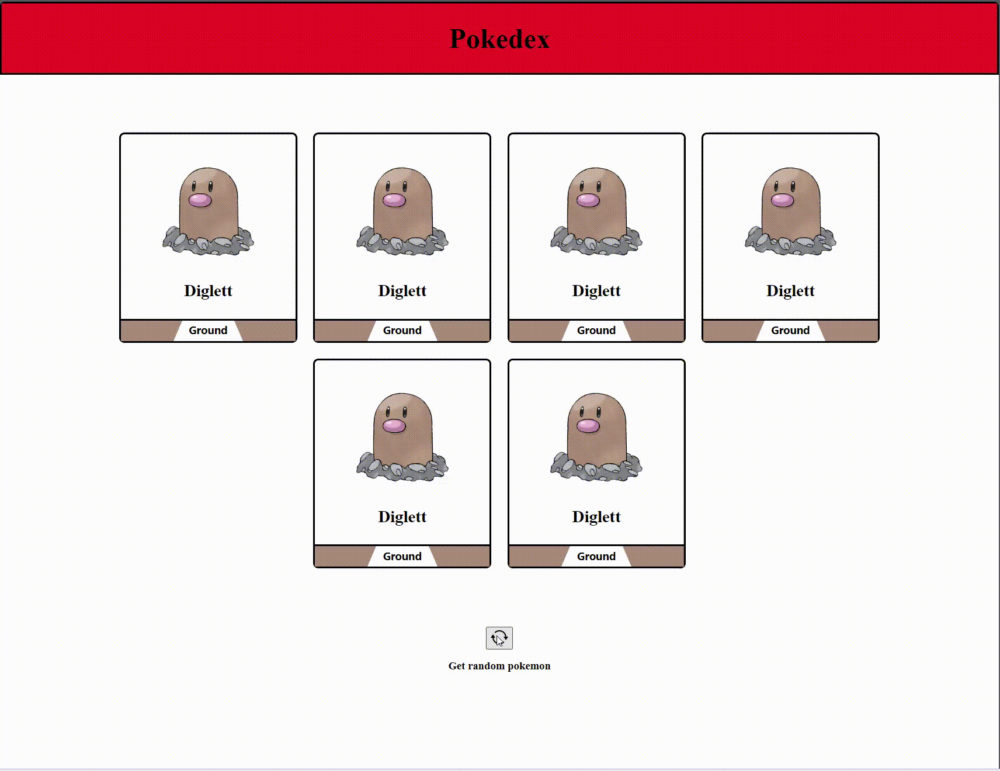
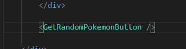

# Fetch & APIs continued 

## Assignment: JokeView + Pokedex (React Version)

#### Overview
In this assignment, you will configure two different webpages written in React to request data from an api. You will use the response data from the API to update the page with new information.

<div style="display: flex; flex-direction: column; justify-content: center;  align-items: center;
">  <div>
    <h1 style="margin-right: 1%; margin-top: 1%; text-align:center; margin-bottom: 0px;" >Part 1: JokeView</h1>
   <h3 style="text-align: center; margin-top: 0px;">API Endpoint: <a href="https://official-joke-api.appspot.com/random_joke">https://official-joke-api.appspot.com/random_joke</a></h3>

    
   <h1 style="margin-right: 1%; margin-top: 1%; text-align:center" >Part 2: PokeDex</h1>
   <h3 style="text-align: center; margin-top: 0px;">API Endpoint: <a href="https://pokeapi-ptvv.onrender.com/pokemon/team">https://pokeapi-ptvv.onrender.com/pokemon/team</a></h3>
   
  </div>
</div>


### Instructions


### **Part 1: JokeView (React Version)**
https://official-joke-api.appspot.com/random_joke
<details>

<summary>Preview</summary>


</details>
<br>

1. When a user clicks the "See punchline" button, unhide the punchline (this has already been done for you)

    <br>


2. When a user clicks the "Refresh Joke" button, fetch a random joke from the Jokes API and replace the current joke on the page with a new joke

    <br>

    - Change the variable that holds the joke data to a [React state variable](https://react.dev/reference/react/useState) ([line 8 in App.js](jokeview/src/App.js))  

    <br>


    - When a user clicks the 'Refresh Joke' button, use the [fetch function](https://www.freecodecamp.org/news/make-api-calls-in-javascript/) to send a HTTP request to [the random Joke endpoint](https://official-joke-api.appspot.com/random_joke) and update the state variable with the new joke from [the API](https://official-joke-api.appspot.com/random_joke)

<br>


### **Part 2: Pokedex (React Version)**
https://pokeapi-ptvv.onrender.com/pokemon/team
<details>

<summary>Preview</summary>


</details>
<br>

1. When a user clicks the "Get random pokemon" button, fetch a new batch of pokemon objects from [the random pokemon endpoint](https://pokeapi-ptvv.onrender.com/pokemon/team) and replace the current set of pokemon on the page with the pokemon received from the api

    <br>

    - Change the variable that holds the array of pokemon data to a [React state variable](https://react.dev/reference/react/useState) ([line 5 in App.js](pokedex/src/App.js))  

    <br>

    - When a user clicks the 'Get random pokemon' button, use the [fetch function](https://www.freecodecamp.org/news/make-api-calls-in-javascript/) to send a HTTP request to [the random pokemon endpoint](https://pokeapi-ptvv.onrender.com/pokemon/team) and update the state variable with the new array of pokemon objects from [the API](https://pokeapi-ptvv.onrender.com/pokemon/team)

    <br>

    - The footer of each pokemon card should represent the the "type" of pokemon it holds 

      -  | Pokemon Type  | Footer Color |
         | ------------- | ------------- |
         | Fire          | Red           |
         | Grass         | Green         |
         | Electric      | Yellow        |
         | Water         | Blue          |
         | Fairy         | Pink          |
         | Bug           | Black         |
         | Poison        | Purple        |
         | Ground        | Brown         |
         | Normal        | Brown         |

    ### Bonus - Submit the assignment before attempting this

    - Replace the code for the 'Get random pokemon' button in [App.js](./pokedex/src/App.js) with a custom React component called "GetRandomPokemonButton" 
    
        <br>

        - Create a file called GetRandomPokemonButton.js in the [src folder of the pokedex app](./pokedex/src/) 

        <br>


        - Inside GetRandomPokemonButton.js, create a React component function called GetRandomPokemonButton and configure it to [return](https://www.w3schools.com/jsref/jsref_return.asp) the HTML for the 'Get random pokemon' button 
        
        <br>
        
        - <details>

            <summary>Export the GetRandomPokemonButton function from GetRandomPokemonButton.js </summary>
            <br>

            ```javascript
                export default GetRandomPokemonButton;
            ```
        </details>
        <br>

        - <details>

            <summary>
                Import the GetRandomPokemonButton function from <a href="/pokedex/src/GetRandomPokemonButton.js<">GetRandomPokemonButton.js</a> into <a href="./pokedex/src/App.js">App.js</a></summary>
            <br>

            ```javascript
                import GetRandomPokemonButton from "./GetRandomPokemon"
            ```
        </details>
        <br>

        - <details>

            <summary>
                Replace the HTML code for the 'Get random pokemon' button in App.js with a GetRandomPokemonButton component  </summary>
            <br>

            
        </details>
        <br>

        - How would you preserve the functionailty of the 'Get random pokemon' button after moving the code into a custom component?
            
            - Hint: use [props](https://react.dev/learn/passing-props-to-a-component)


<br>